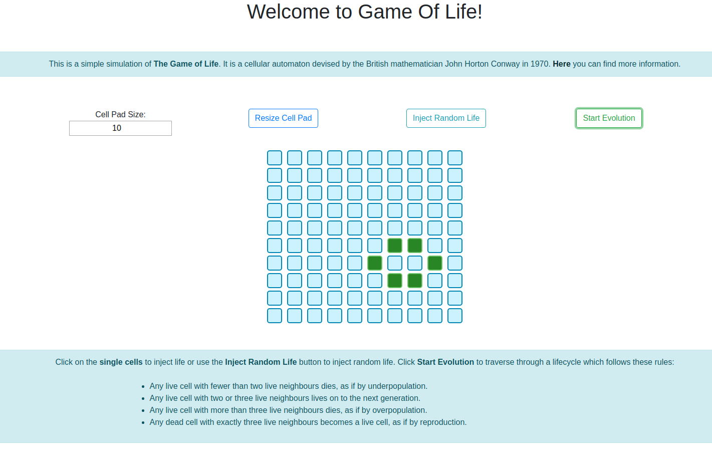

# Game Of Life Simulation

This little app simulates Game Of Life according to simple rules:

- Any live cell with fewer than two live neighbours dies, as if by underpopulation.
- Any live cell with two or three live neighbours lives on to the next generation.
- Any live cell with more than three live neighbours dies, as if by overpopulation.
- Any dead cell with exactly three live neighbours becomes a live cell, as if by reproduction.



# How to build

Clone the repo and install:

```
git clone
cd GameOfLife
npm install
```

To test the app locally use

```
npm start
```

Now the app is available in [localhost:4200](localhost:4200).

To build and run the app in a Docker:

```
docker image build -t game_of_life:1.0 .
docker run --rm -p 3000:8080 --name game_of_life game_of_life:1.0
```

Now the app runs within a Docker Container and is accessible in [localhost:4200](localhost:4200)

# Running in the Cloud

A running example can be found in https://gameoflife-ukigudzrfq-ew.a.run.app/

# Next Steps

Currently there is an error and the app evolution stops in situation where it should keep running.
